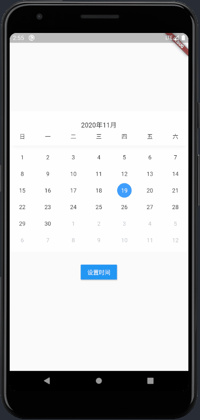

# FullCalendar

English | [简体中文](./README-ZH-CN.md)

A calendar plugin for Flutter



## Installation
Added on pubspec.yaml file dependencies
```
full_calendar: ^0.0.1
```

Run in your terminal
```
flutter packages get
```

## Example
```dart
FullCalendar(
  min: DateTime(2018),
  max: DateTime(2021),
  onChange: (value) {
    print(value);
  },
),
```

## Api
- ```value```
  - ```DateTime```
  - The time currently selected
- ```min```
  - ```DateTime```
  - The minimum time
- ```max```
  - ```DateTime```
  - Maximum time
- ```onChange```
  - ```void Function(DateTime)```
  - A callback after selecting the time

## to-do
- [x] Single time selection
- [] Multiple time selection
- [] Time period selection
- [] Custom theme
